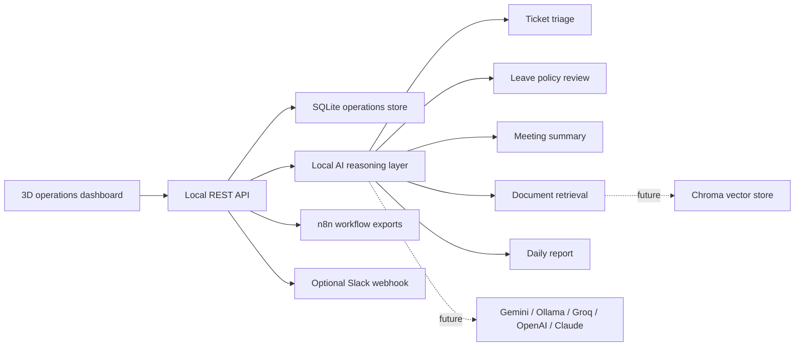

# Architecture

OpsPilot is built as a local-first automation platform. The prototype keeps model calls out of the critical path, which makes the demo reliable without paid keys and gives the system clean upgrade points.

## Runtime

- `app/main.py` serves the API and frontend.
- `app/store.py` owns SQLite persistence.
- `app/brain.py` owns local classification, summarization, retrieval, and reporting.
- `frontend/` is a static dashboard with no build step.

## Data Flow

1. A user creates an operations artifact in the UI.
2. The API validates the payload.
3. The local reasoning layer adds category, priority, recommendation, summary, actions, or answer.
4. The enriched record is saved in SQLite.
5. The dashboard refreshes the summary snapshot.

## Production Shape

For production, keep the API contract and replace the local reasoning functions with provider adapters:

- Ticket triage: Gemini Flash, Groq Llama, or OpenAI mini model.
- Document Q&A: Chroma with local sentence-transformers or a managed embedding API.
- Meeting summaries: model adapter with structured JSON validation.
- Reports: scheduled n8n or Celery job.
- Notifications: Slack webhook or Microsoft Teams connector.

## Security

- Keep HR and payroll documents in a private store.
- Do not send confidential documents to free tiers that train on submitted data.
- Add authentication before exposing the dashboard outside localhost.
- Log decision metadata, not full sensitive payloads.
- Keep a human approval step for leave rejection, payroll, and disciplinary actions.
