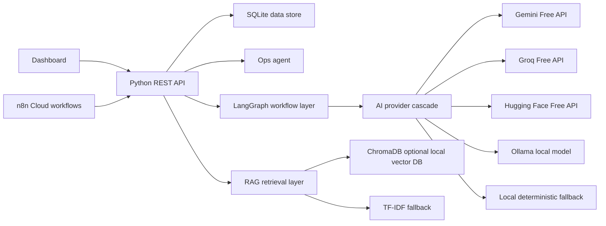
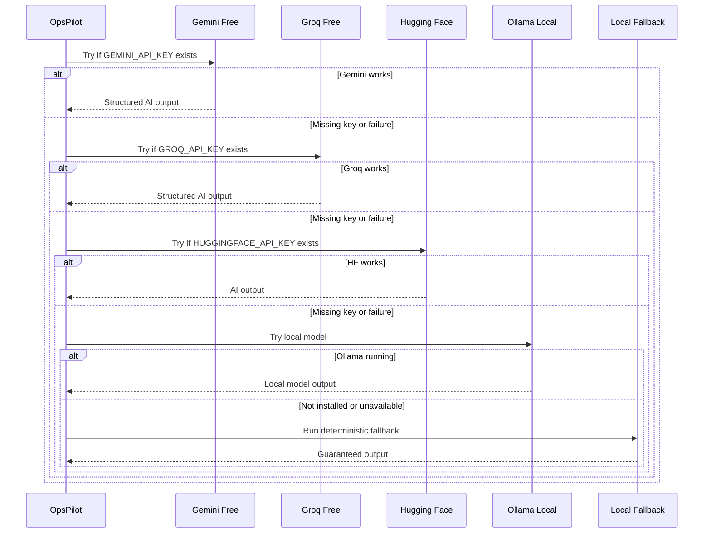
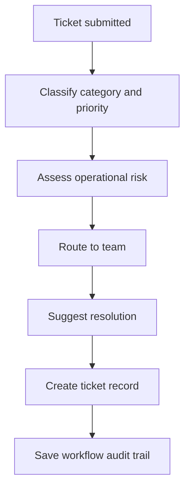
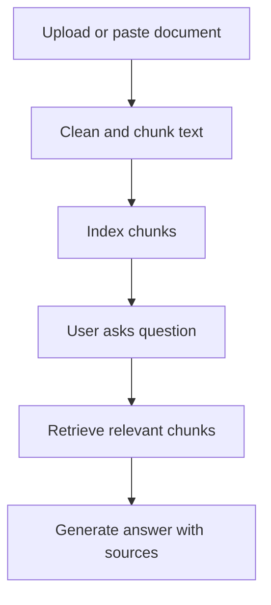
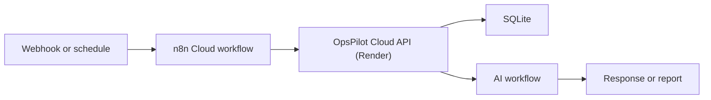

# OpsPilot Architecture

OpsPilot is an internal operations automation platform for ticket triage, leave review, meeting summarization, document Q&A, task extraction, daily reporting, and operations chat.

The design is free-first. It can use free cloud AI APIs when keys are available, local Ollama when installed, and deterministic fallback logic when nothing else is configured.

## Runtime Components

| Component | Technology | Role |
|---|---|---|
| Dashboard | HTML, CSS, JavaScript | User-facing operations console |
| API | Python stdlib HTTP server | Serves frontend and REST endpoints with zero hard dependency on paid services |
| Workflow engine | LangGraph when installed, sequential fallback otherwise | Multi-step ticket processing: classify, assess risk, route, resolve |
| LLM layer | Gemini Free, Groq Free, Hugging Face Free, Ollama | Free-first AI reasoning |
| RAG layer | Local TF-IDF today, ChromaDB optional | Search policy and operations documents |
| Automation | n8n Cloud | Webhooks, scheduled reports, no-code workflow proof |
| Storage | SQLite (Persistent Disk) | Tickets, leave requests, meetings, documents, tasks, workflow runs |

## Provider Cascade

## Workflow Flow

## RAG Flow

## n8n Cloud Flow

## Deployment Modes

| Mode | Cost | AI behavior | Best for |
|---|---:|---|---|
| Local no-key | $0 | Local fallback, optional Ollama | Guaranteed evaluator demo |
| Local full AI | $0 | Ollama + n8n + workflow engine | Strongest assignment walkthrough |
| Online free demo | $0 | Free APIs if configured, fallback if not | Manager/public link |
| Online production | Low paid infra | Free APIs or paid upgrade, hosted database | Team use |

## Production Notes

- Use Render or Hugging Face Spaces for a public demo URL.
- Use free Gemini/Groq keys for online AI quality without paid billing.
- Use Ollama for local/private AI because most free hosts cannot run LLMs reliably.
- Add authentication before using real HR or payroll data.
- Move from SQLite to PostgreSQL once multiple real users write concurrently.
