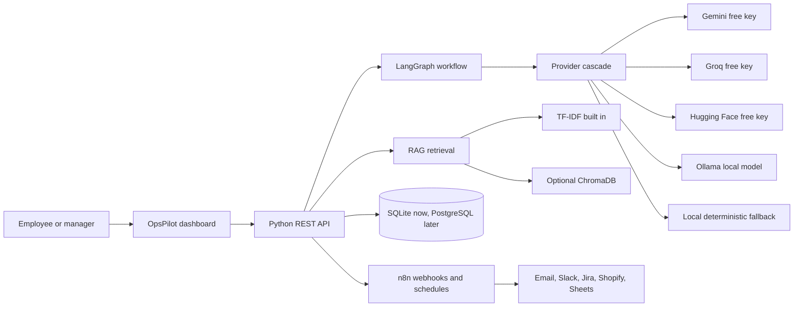

# Recommendation Report

## Recommended Architecture

OpsPilot should use a free-first internal automation architecture:

The POC already implements the core backend, frontend, workflow engine, RAG layer, local fallback, optional free providers, Docker deployment files, and n8n workflow exports.

## Tool Selection

| Requirement | Selected Tool | Reason |
|---|---|---|
| No paid AI dependency | Local fallback and Ollama | The system runs even with no cloud model key |
| Free cloud AI | Gemini, Groq, Hugging Face | Optional quality and speed boost using free tiers |
| Multi-step AI automation | LangGraph | Clear audit trail for classify, risk, route, resolve |
| External workflow automation | n8n | Free self-hosted automation with webhooks and schedules |
| RAG/vector database | TF-IDF plus optional ChromaDB | Works immediately and upgrades to local vectors |
| Storage | SQLite for POC | Zero configuration and easy local deployment |
| Future storage | PostgreSQL | Better concurrency and managed deployment support |
| UI | Custom responsive dashboard | No generic template, no build step, manager-friendly demo |

## Why This Architecture Was Selected

The assignment asks for practical AI understanding, architecture thinking, tool selection reasoning, and production deployment thinking. A single chatbot would be too basic. OpsPilot instead shows a real operational system:

1. Tickets enter through the API or UI.
2. LangGraph runs a workflow with separate steps.
3. The provider cascade tries free cloud APIs, Ollama, and local fallback.
4. The output is stored with an audit trail.
5. n8n can trigger the same API from webhooks or schedules.
6. RAG retrieves policy context for document Q&A.
7. Reports and the agent summarize the live operational state.

## Estimated Infrastructure Cost

| Stage | Hosting | AI | Database | Vector DB | n8n | Estimated Monthly Cost |
|---|---|---|---|---|---|---|
| Current local POC | Laptop | Local fallback/Ollama | SQLite | TF-IDF | Local Docker | $0 |
| Free online demo | Render free tier | Local fallback or free keys | SQLite disk | TF-IDF | Not always-on unless self-hosted | $0 |
| Small team | Render/Railway starter | Mostly Gemini/Groq free or low paid use | PostgreSQL | ChromaDB/Weaviate | Self-hosted VPS | $10-$40 |
| Production | Container service | Paid fallback budget | Managed PostgreSQL | Weaviate/Pinecone | n8n queue workers | $80-$300 |

For a manager demo today, no paid service is needed.

## Risks and Limitations

| Risk | Impact | Mitigation |
|---|---|---|
| Free API rate limits | Slower or failed cloud responses | Provider cascade plus local fallback |
| Local model quality varies | Smaller Ollama models may be less accurate | Use cloud free providers for better quality when available |
| No authentication in POC | Public deployment would be unsafe | Add login before sharing beyond demo users |
| SQLite concurrency | Not ideal for heavy multi-user production | Move to PostgreSQL in production |
| AI mistakes in HR decisions | Bad recommendations could affect employees | Keep human approval for leave and high-risk actions |
| n8n self-hosting | Another service to operate | Use Docker Compose now, separate worker later |

## Production Scaling Plan

### Phase 1: Submission POC

Use the current repository. Run locally or deploy to Render. Keep no paid AI requirement. Use included n8n workflow JSON files for architecture proof.

### Phase 2: Team Pilot

Add authentication, role-based access, PostgreSQL, and a hosted n8n instance. Connect email or Slack using n8n. Keep Ollama for private cases and free model APIs for cheaper general tasks.

### Phase 3: Production

Move to a managed database, deploy API containers with health checks, add monitoring, store full workflow audit logs, and enable ChromaDB or Weaviate for persistent vector search.

### Phase 4: Enterprise

Add SSO, approval workflows, retention policies, encryption at rest, usage analytics, quality evaluation sets, and per-department model routing.

## Business Impact

OpsPilot can reduce manual operations work in five areas:

| Workflow | Manual Work Reduced |
|---|---|
| Ticket triage | Classification, priority, team routing, resolution suggestions |
| Leave review | Policy checks, flags, manager review recommendation |
| Meeting follow-up | Summaries, decisions, action items |
| Policy Q&A | Faster answers from internal documents |
| Daily report | Automatic operational summary from live data |

The strongest business value is consistency: the same rules and workflow are applied every time, and risky decisions are visible for human review.

## Final Recommendation

Submit OpsPilot as the recommended architecture. It meets the free/no-paid-API constraint, uses n8n, LangGraph, RAG, optional Ollama, optional free APIs, and includes real deployment planning. The current prototype is advanced enough for review because it is not just a UI mockup; it has a working backend, persistent data, workflow audit trail, report generation, document retrieval, and importable n8n workflows.
